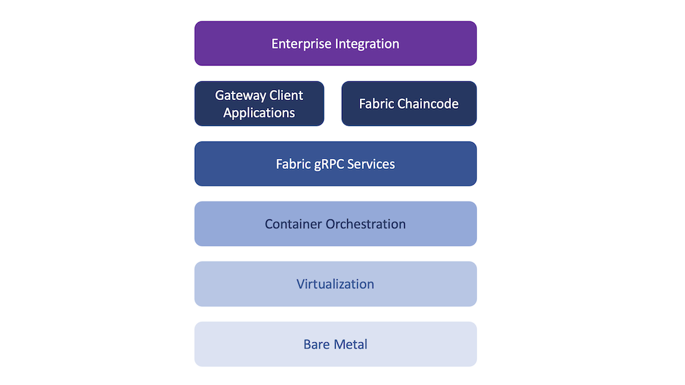

# 云原生

==> [下一步: 部署一个kube集群](./10-kube-zh.md)

---

Hyperledger Fabric的云原生支持一个Hyperledger Fabric中立的分层透视图,其中集成了容器，服务，和API。在这个workshop的这部分例子中，您将会完整的运行应用并且可以尝试从本地开发环境部署到公有云环境中。



云原生结构堆栈中的每个应用程序层通常都是模块化的，只需对在不同环境之间切换。在每个应用程序层，客户端库和连接URL用于确保跨运行时堆栈的可移植性和独立性。

例如：
- Hyperledger Fabric peer，orderer和CA节点之间的交互都通过编译后的可执行文件，交互通过TCP和GRPCs的方式。一旦Hyperledger Fabric网络被建立，所有的管理员和账本访问将通过服务的方式进行。因此对外Hyperledger Fabric网络仅仅暴露服务地址和x509证书。

- 所有和容器的交互都通过k8s API完成，在后续的练习中您将会使用`kubectl`命令从宿主机（本机）访问并连接容器。请注意，这种方式并不局限在本地，您也可以通过合适的配置来访问您的远程集群。
  
- 一些必要的虚拟化技术对本实验有所帮助。您可能需要通过multipass/vagrant或远程虚拟机来执行这个实验。详细信息请参考原文：
In some cases a virtualization layer is necessary to emulate the cloud-native practices.  For instance, a VM running
  locally with multipass/vagrant (or a remote instance at EC2) can be used to supplement a local development workflow.
  This can be extremely useful as a means to build platform-neutral runtimes, supporting a variety of chipsets and
  development environments (WSL2, Mac M1, z/OS, amd64, etc.)

在使用一个 _Cloud Native Fabric_ 堆栈时，您会感到非常困惑。当你是感觉迷失了，专注于上面的分层堆栈，帮助重新定位自己，找到指南针方位，然后继续前进。
通常，每个应用程序层都被设计为仅与堆栈中其下的直接层一起工作。

在本次的云部署之旅中，您也许需要牢记一些知识点（下列知识点涉及部分专有词汇，为防止误解，不做翻译）：
1. Services are backed by URLs.  (It does not matter _where_ the endpoints are running, only how you _locate_ them.)

2. Services run in [OCI Containers](https://github.com/opencontainers/image-spec) and are orchestrated by Kubernetes.

3. All client programs run on your machine, connecting to service endpoints "running somewhere" on a hybrid cloud. 

4. At some point in this course, you may encounter a chaincode contract running in a Java Virtual Machine, running in a
   docker container, executing as a service running on Kubernetes, which is running in a Docker container, which
   is running on a virtual machine, which is running on an x86 emulation layer, which is running on hyperkit, which is
   running on Mac M1 silicon on your laptop.  At many times, you will forget _where_ your code is running, and question
   if it is in fact running at all.  Do not be alarmed:  this is a natural reaction to container based application
   workflows.  (See points 1, 2, and 3 above.)


## 让我们开始吧
运行一下程序来检查我们需要的工具是否安装完毕
```shell
# If the check passes, proceed to "Deploy a Kube":
./check.sh
```


## 需要安装工具：
我们需要一些客户端程序来完成这个实验。
您可以使用`./check.sh`来进行检查和查看，或者通过网页的方式：
- [fabric-samples](https://github.com/hyperledger/fabric-samples) (This GitHub project):
```shell
git clone https://github.com/hyperledger/fabric-samples.git fabric-samples
cd fabric-samples/full-stack-asset-transfer-guide
```

- [docker](https://www.docker.com/get-started/)

- [kubectl](https://kubernetes.io/docs/tasks/tools/)

- [jq](https://stedolan.github.io/jq/download/)

- [k9s](https://k9scli.io/topics/install/) (recommended)

- Hyperledger Fabric [客户端](https://hyperledger-fabric.readthedocs.io/en/latest/install.html#download-fabric-samples-docker-images-and-binaries):
```shell
curl -sSL https://raw.githubusercontent.com/hyperledger/fabric/main/scripts/install-fabric.sh | bash -s -- binary

```

- 本实验需要的环境变量:
```shell

export WORKSHOP_PATH=$(pwd)
export FABRIC_CFG_PATH=${WORKSHOP_PATH}/config  
export PATH=${WORKSHOP_PATH}/bin:$PATH

```

## 如果还有问题，请参考下列原文

For the duration of the workshop, a number of temporary, short-run virtual machines will be available on the web for
your usage.  The systems have been provisioned with a [#cloud-config](../../infrastructure/ec2-cloud-config.yaml) and
include all dependencies necessary to run the cloud-native workshop.  Check your "Conga Card" for the instance IP and
ssh connection details.


--- 

==> [下一步: 部署一个kube集群](./10-kube.md)
